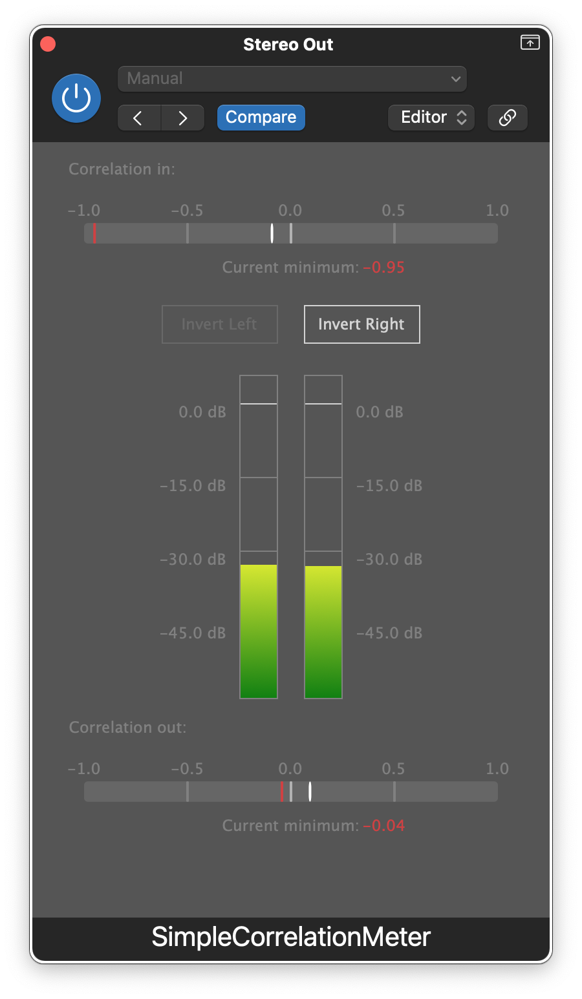

# simple-correlation-meter
Simple correlation meter with phase inversion option. Practice project to learn the JUCE framework.

Demo video: https://drive.google.com/file/d/1nLsk_6keDAaFSayGEnXDyOVJSusYHPOE/view?usp=sharing

Learned to display level meters from this great tutorial by Akash Murthy https://www.youtube.com/watch?v=ILMdPjFQ9ps&ab_channel=AkashMurthy
